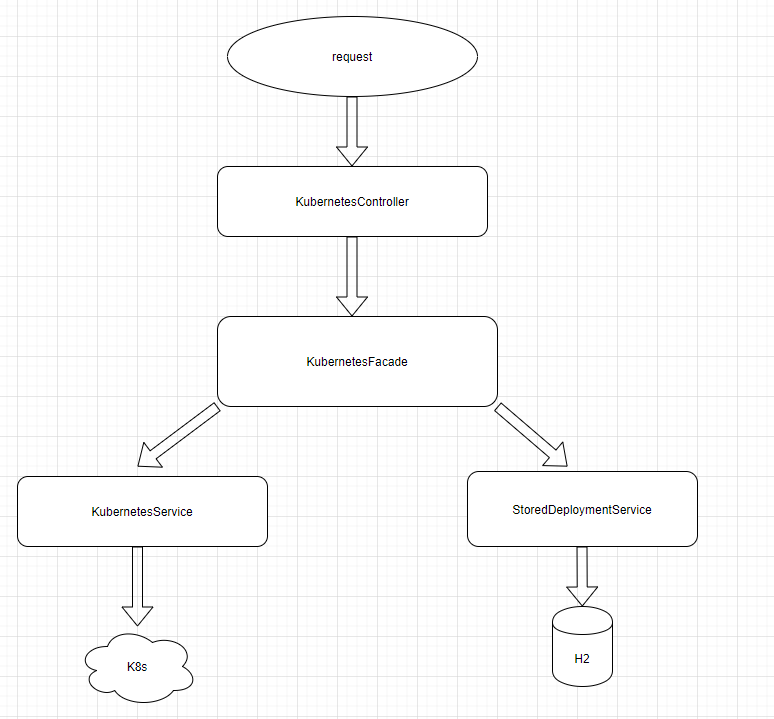

# k8sadmin

## admin rest api for k8s clusters.
## This app can get/create deployments in the k8s cluster and also get persist deployment samples from H2 db
## H2 used as cache for your deployments history

## Main diagram
- 
### Users:
`user\password` - can list deployments;
`admin\password` - can list and create deployments

### How to build docker image: 
`mvn clean install`

### Execution modes:
- Local mode: one way - download your own k8s config from cluster and provide it as a mounted volume
Example:
```
docker run -p 8080:8080 -v $(pwd):/k8s -e "KUBERNETES_AUTH_TRYKUBECONFIG=true" -e "KUBECONFIG=/k8s/config" -e "KUBERNETES_AUTH_TRYSERVICEACCOUNT=false" -t ivzh/k8sadmin:0.0.1-SNAPSHOT
```

- Cluster deployment mode: as a pod inside k8s. Prepare service account before execution. Example in the `examples\sa.yaml`
Example:
```
kubectl create ns sysns && kubectl apply -f examples/sa.yaml && kubectl apply -f examples/k8sadmin
```

k8sadmin is using `fabric8 kubernetes client` as a main library for communicating with k8s clusters. 
Other connection modes can be configured by setting up different environment variables from: https://github.com/fabric8io/kubernetes-client/#configuring-the-client

### How to run queries:

There are 2 examples: postman collection in `k8sadmin.postman_collection.json` and curl steps

#### 1) Login:
``` 
curl -X POST http://localhost:8080/signin -H "Content-Type:application/json" -d "{\"username\":\"admin\", \"password\":\"password\"}"
```

Response could be: 
```
{"token":"eyJhb..."}
```

#### 2) copy token and get data from `default` namespace:
```
curl -H "Authorization: eyJhb..."  http://localhost:8080/deployments/default/
```

Response:
```
[
    {
        "name": "nginx",
        "dockerImage": "nginx",
        "replica": 1,
        "port": 80
    },
    {
        "name": "httpbin",
        "dockerImage": "docker.io/citizenstig/httpbin",
        "replica": 1,
        "port": 8000
    }
]
```

#### 3) get detailed information about service:
```
curl -H "Authorization: eyJhb..."  http://0.0.0.0:8080/deployments/default/nginx
```

#### 4) create service(requires `admin` access token)
```
curl -X POST http://localhost:8080/deployments/default/nginx -H "Content-Type:application/json" -d "{\"name\":\"nginx\", \"dockerImage\":\"nginx\", "replica":1, \"port\":80}"
```

#### 5) for persisting data to h2 db add frag `?useStorage=true` to each query. 
For create - it creates service in k8s and save original config into h2. 
get queries are reading data from h2(return origin configs of created deployments)

### Tests: 
could be executed from ide

### Known issues:
0) fix test execution from mvn side
1) for `AWS EKS` probably need to install `aws iam authentificator` to the docker image. I tested on the `Azure AKS` 
2) need to enhance `GET` endpoint for reading detailed info about service
3) write more tests